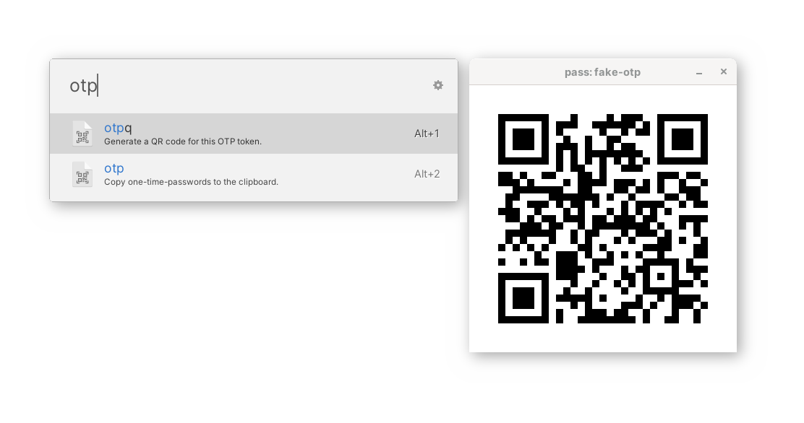

# Pass OTP for Ulauncher

A Ulauncher wrapper around [pass-otp](https://github.com/tadfisher/pass-otp).

## Features

- Copy one-time-passwords to the clipboardd
- Display one-time-password tokens as a QR code

## Dependencies

- [qrencode](https://fukuchi.org/works/qrencode/) to display QR codes. This program can likely be found in your package repositories

## Acknowledgements

- [PapirusDevelopmentTeam](https://github.com/PapirusDevelopmentTeam/papirus-icon-theme) for the pretty file icon
- [Bootstrap Icons](https://icons.getbootstrap.com/) for the little QR code icon
- [cdown's](https://github.com/cdown) script, [passmenu](https://git.zx2c4.com/password-store/tree/contrib/dmenu/passmenu), whose functionality inspried this extension

